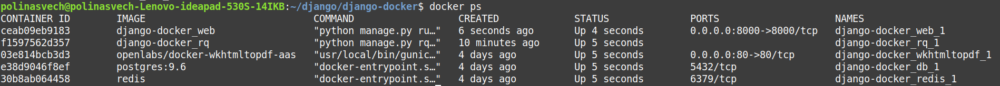

# Printer API

Для создания чеков передите на 
http://localhost:8000/create_checks/

--------------------------------------
Для получения списка новых чеков перейдите на 
http://localhost:8000/new_checks/?api_key=<printer_api_key>

Для получения PDF-файла чека перейдите на http://localhost:8000:8000/check/?api_key=<priner_api_key>&check_id=<check_id>>

-------------------------------------
Для просмотра всех чеков перейдите на http://localhost:8000/admin/checkservice/check/

Для просмотра всех принтеров http://localhost:8000/admin/checkservice/printer/

-------------------------------------------
Для отслеживания работы воркера перейдите на http://localhost:8000/admin/rq/
___________________________________________
Во время **первого** запуска из корня проекта необходимо выполнить
```
docker-compose build
```
Если сборка завершилась без ошибок, выполняем 
```
docker-compose up -d
```
чтобы запустить контейнеры в фоновом режиме.

Затем выведем с помощью команды 
```
docker ps
```
выведем информацию о запущенных контейнерах, среди которых найдем контейнер *web*.


Далее создаем и прогоняем миграции с помощью команд
```
docker exec -it <id контейнера web> python manage.py makemigrations
docker exec -it <id контейнера web> python manage.py migrate
```
Затем создаем пользователя для входа административный раздел
````
docker exec -it <id контейнера web> python manage.py createsuperuser
````
Введенные имя пользователя и пароль будут использоваться для
доступа к http://localhost:8000/admin/checkservice/...

Также загрузим начальные данные для таблицы принтеров с помощью 
```
docker exec -it <id контейнера web> python manage.py loaddata printer_data.json
```
Чтобы остановить работу всех контейнеров
```
docker stop $(docker ps -q)
```
В дальшейшем для запуска проекта можно использовать
```
docker-compose up
```
